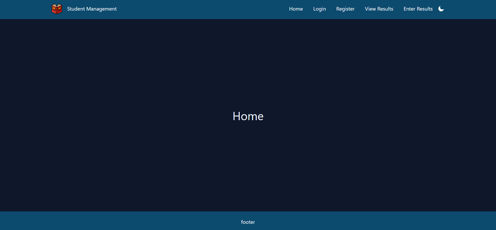
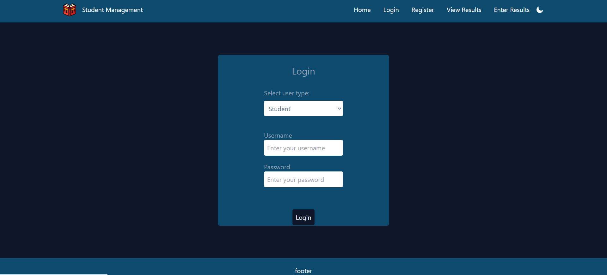
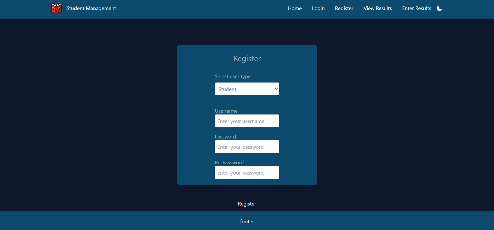
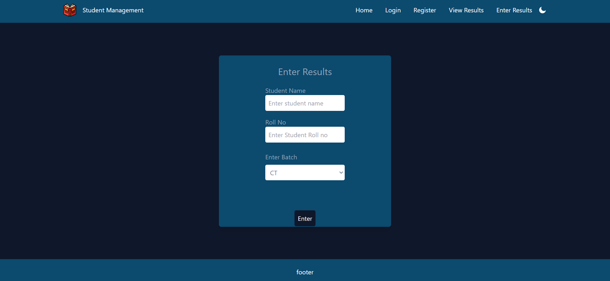

# STUDEENT MANAGEMENT SYSTEM  

## _PROJECT GROUP 2_
                      

* Develop Student Result Management System.
* Provides Examination Result to the Students.
* Mainly concentrate on external exams.
* They can also view and analyse their result status.

